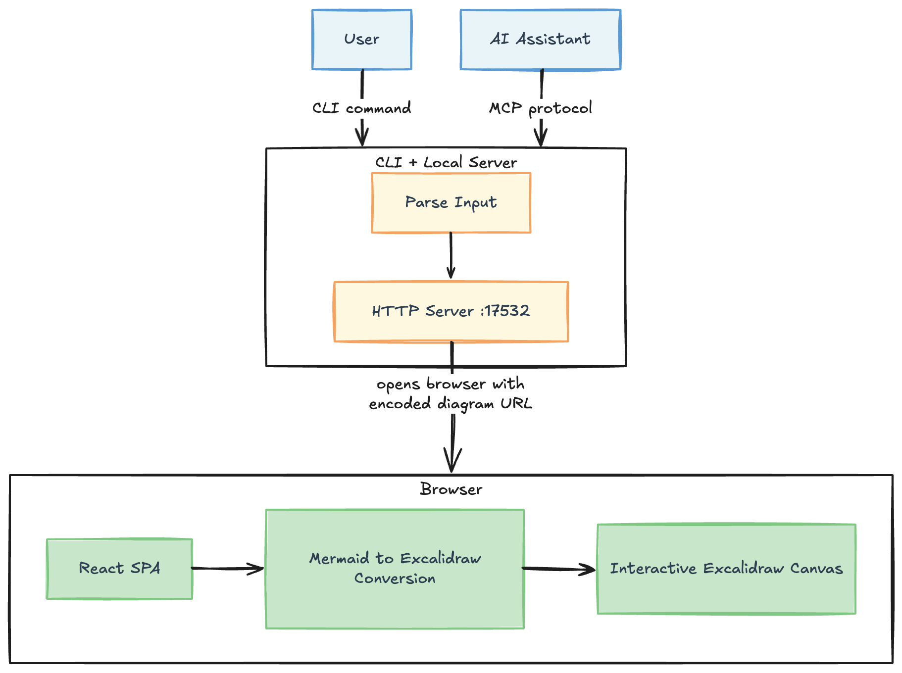

# Excalimaid

[](https://www.npmjs.com/package/excalimaid)

Converts Mermaid diagrams into Excalidraw diagrams, serves them locally, and opens the result in your browser. Includes an MCP server for AI assistants. All processing is done locally, no data is sent to external servers.

## Installation

```sh
npm install -g excalimaid
```

## Usage

### CLI

Open a Mermaid diagram in Excalidraw:

```sh
excalimaid 'graph TD
A-->B'
```

Or pipe via stdin:

```sh
cat diagram.mmd | excalimaid
```

#### Tip

Add to your `~/.zshrc` or `~/.bashrc` to open whatever Mermaid diagram is in your clipboard:

```sh
alias mmd='pbpaste | excalimaid'
```

Then just copy a Mermaid diagram and run `mmd`.

### MCP Server

Excalimaid provides an MCP server for AI assistants:

```sh
excalimaid mcp
```

**Tool: `open-diagram`**

Opens a Mermaid diagram in Excalidraw. Supports Flowchart, Sequence, and Class diagrams.

```json
{
  "name": "open-diagram",
  "arguments": {
    "mermaid": "graph TD\nA-->B"
  }
}
```

Starts a local HTTP server on the default port 17532 (configurable via `EXCALIMAID_PORT`), opens your browser, and returns the URL.

The server auto-shuts down after 5 minutes of inactivity.

#### MCP Setup

Configure excalimaid in your MCP client:

**OpenCode** (`opencode.json`):
```json
{
  "$schema": "https://opencode.ai/config.json",
  "mcp": {
    "excalimaid": {
      "type": "local",
      "command": ["npx", "-y", "excalimaid@latest", "mcp"],
      "enabled": true
    }
  }
}
```

**Claude or Cursor** 
```json
{
  "mcpServers": {
    "excalimaid": {
      "command": "npx",
      "args": ["-y", "excalimaid@latest", "mcp"]
    }
  }
}
```

Once configured, the `open-diagram` tool will be available to your AI assistant.

## Configuration

| Variable | Description | Default |
|---|---|---|
| `EXCALIMAID_PORT` | Port for the local HTTP server | `17532` |
| `EXCALIMAID_IDLE_TIMEOUT` | Idle timeout in minutes before the server shuts down | `5` |

Example:

```sh
EXCALIMAID_PORT=8080 excalimaid 'graph TD
A-->B'
```

## How it works


*Made with the tool itself, obviously*

1. The script base64-encodes the Mermaid syntax and passes it as a `?mermaid=` query parameter
2. It serves the `dist/` directory via a minimal HTTP server on the default port 17532
3. The React app decodes the parameter and converts it to Excalidraw elements using `@excalidraw/mermaid-to-excalidraw`
4. The result is rendered in a full-screen Excalidraw canvas

## Development

Clone and setup for local development:

```sh
git clone https://github.com/mklinovsky/excalimaid.git
cd excalimaid
pnpm install
pnpm run build
```

Link globally to use the local version:

```sh
pnpm link --global
```

Now you can run `excalimaid` from anywhere using your local build.
